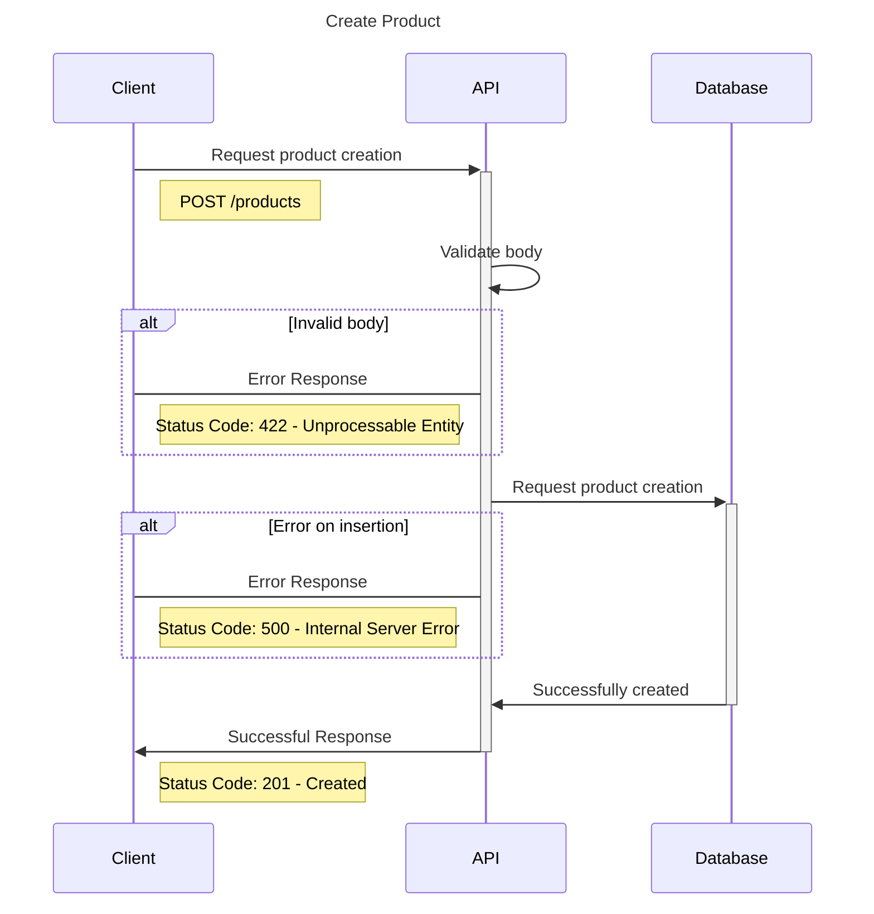
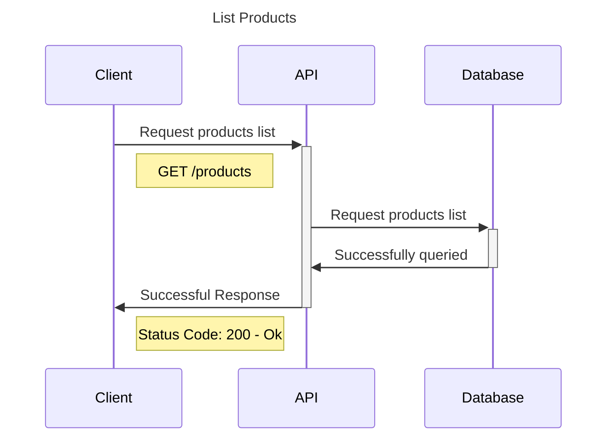
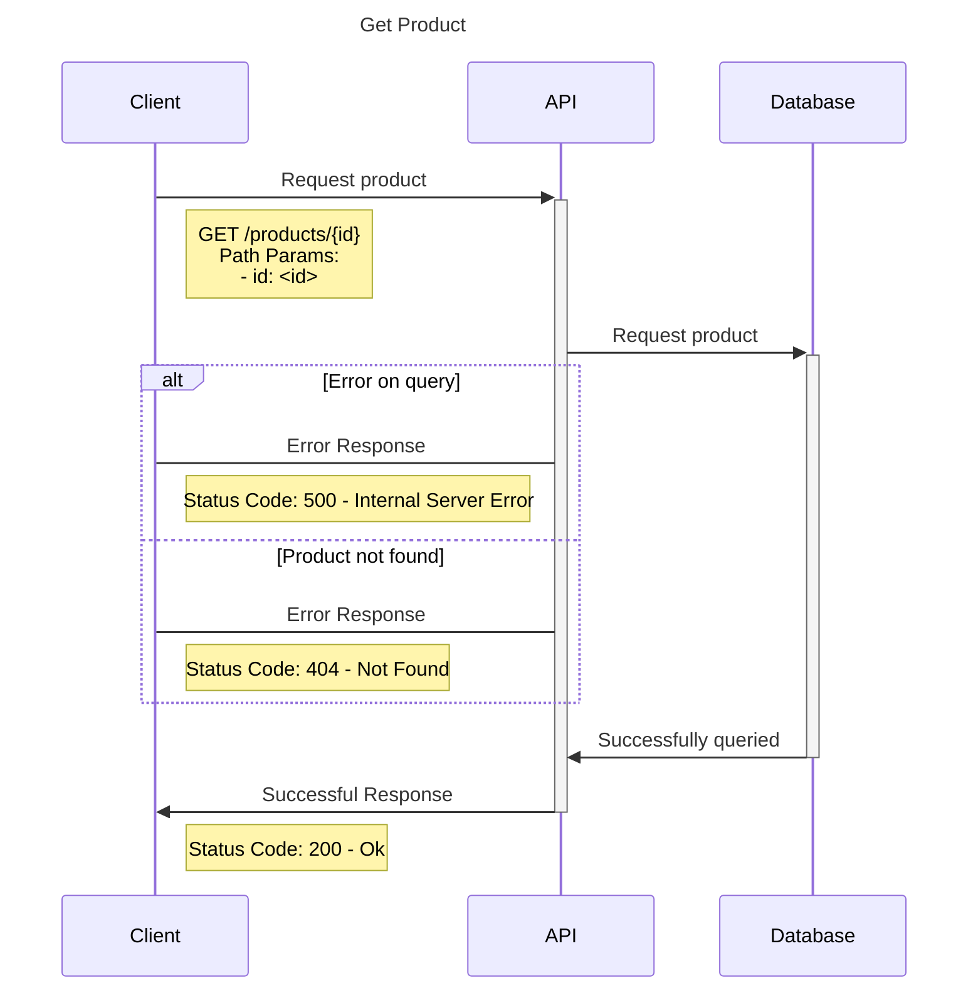
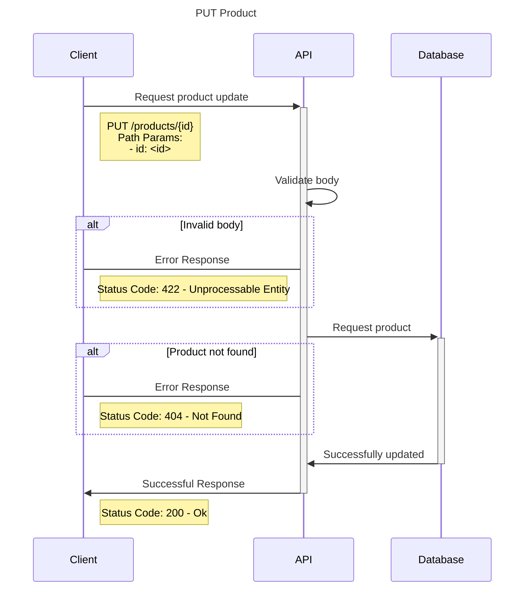
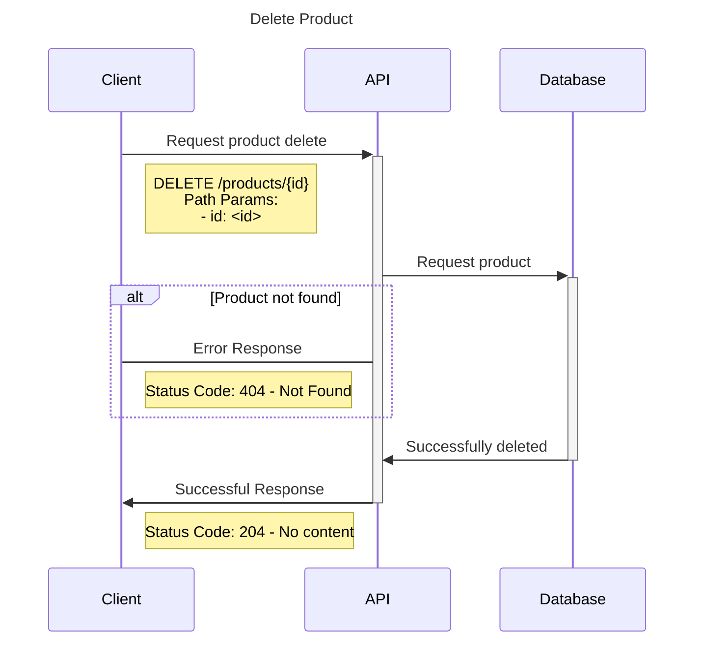

# TDD Project

## O que é TDD?
TDD é uma sigla para `Test Driven Development`, ou Desenvolvimento Orientado a Testes. A ideia do TDD é que você trabalhe em ciclos.

### Ciclo do TDD

### Vantagens do TDD
- entregar software de qualidade;
- testar procurando possíveis falhas;
- criar testes de integração, testes isolados (unitários);
- evitar escrever códigos complexos ou que não sigam os pré-requisitos necessários;

A proposta do TDD é que você codifique antes mesmo do código existir, isso nos garante mais qualidade no nosso projeto. Além de que, provavelmente se você deixar pra fazer os testes no final, pode acabar não fazendo. Com isso, sua aplicação perde qualidade e está muito mais propensa a erros.

# Store API
## Resumo do projeto
Este documento traz informações do desenvolvimento de uma API em FastAPI a partir do TDD.

## Objetivo
Essa aplicação tem como objetivo principal trazer conhecimentos sobre o TDD, na prática, desenvolvendo uma API com o Framework Python, FastAPI. Utilizando o banco de dados MongoDB, para validações o Pydantic, para os testes Pytest e entre outras bibliotecas.

## O que é?
Uma aplicação que:
- tem fins educativos;
- permite o aprendizado prático sobre TDD com FastAPI + Pytest;

## O que não é?
Uma aplicação que:
- se comunica com apps externas;

## Solução Proposta
Desenvolvimento de uma aplicação simples a partir do TDD, que permite entender como criar tests com o `pytest`. Construindo testes de Schemas, Usecases e Controllers (teste de integração).

### Arquitetura
||
|:--:|
| Diagrama de C4 da Store API |

### Banco de dados - MongoDB
||
|:--:|
| Database - Store API |

## StoreAPI
### Diagramas de sequência para o módulo de Produtos
#### Diagrama de criação de produto

#### Diagrama de listagem de produtos

#### Diagrama de detalhamento de um produto

#### Diagrama de atualização de produto

#### Diagrama de exclusão de produto

## Desafio Final
- Create
    - Mapear uma exceção, caso dê algum erro de inserção e capturar na controller
- Update
    - Modifique o método de patch para retornar uma exceção de Not Found, quando o dado não for encontrado
    - a exceção deve ser tratada na controller, pra ser retornada uma mensagem amigável pro usuário
    - ao alterar um dado, a data de updated_at deve corresponder ao time atual, permitir modificar updated_at também
- Filtros
    - cadastre produtos com preços diferentes
    - aplique um filtro de preço, assim: (price > 5000 and price < 8000)

## Preparar ambiente

Vamos utilizar Pyenv + Poetry, link de como preparar o ambiente abaixo:

[poetry-documentation](https://github.com/nayannanara/poetry-documentation/blob/master/poetry-documentation.md)

## Links uteis de documentação
[mermaid](https://mermaid.js.org/)

[pydantic](https://docs.pydantic.dev/dev/)

[validatores-pydantic](https://docs.pydantic.dev/latest/concepts/validators/)

[model-serializer](https://docs.pydantic.dev/dev/api/functional_serializers/#pydantic.functional_serializers.model_serializer)

[mongo-motor](https://motor.readthedocs.io/en/stable/)

[pytest](https://docs.pytest.org/en/7.4.x/)
